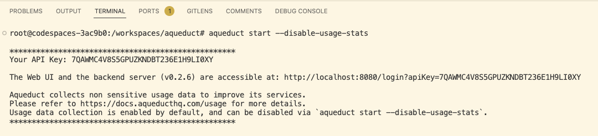
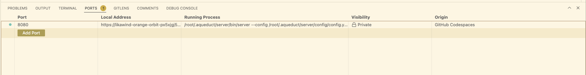
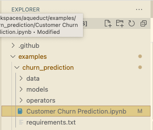

**If you are viewing in VSCode file browser, you can press cmd(ctrl) + shift + V to get a rendered view of this file.**

## Welcome to Aqueduct Codespace
This is a demo codespace that consists of a pre-deployed Aqueduct server. We have also loaded a few example workflows. You can view them [in browser](#explore-aqueduct-ui) and try out yourself in jupyter notebooks.

### Explore Aqueduct UI
A few minutes after the codespace get connected, we automatically start Aqueduct in this codespace. Once you see the following outputs in your **terminal** section, you can open Aqueduct UI by command-clicking the link.

You can also manually access the endpoint by using the link in `PORTS` tab. You may be asked for an API Key. In such case, you can open up a terminal and copy over the output of `aqueduct apikey`.

In case the server is not automatically started, you can open a new terminal window and manually enter `aqueduct start`.

### Run Notebooks
You can find the original notebooks for all example workflows in `examples` directory in the file explorer. To try out a notebook, simply open your faviourite one and run the notebook with the integrated plugin.

